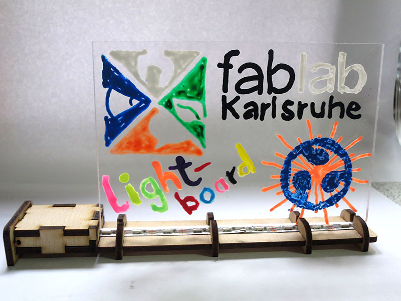
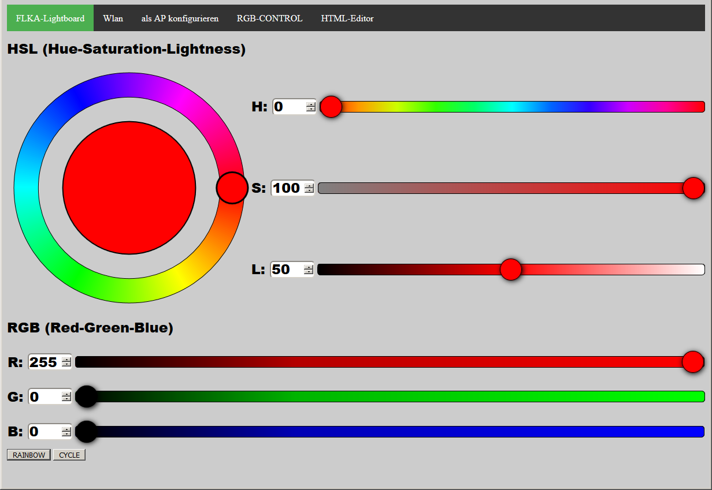
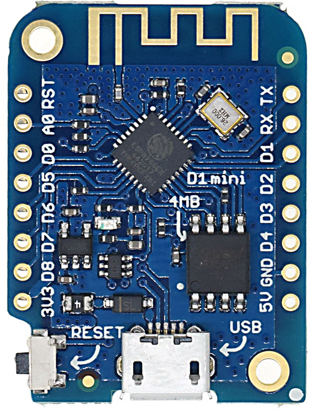
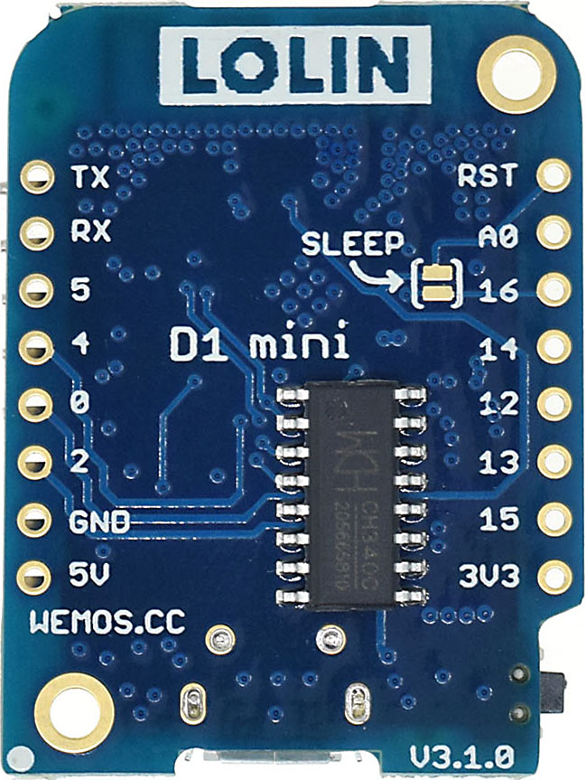
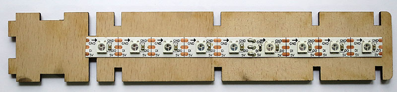
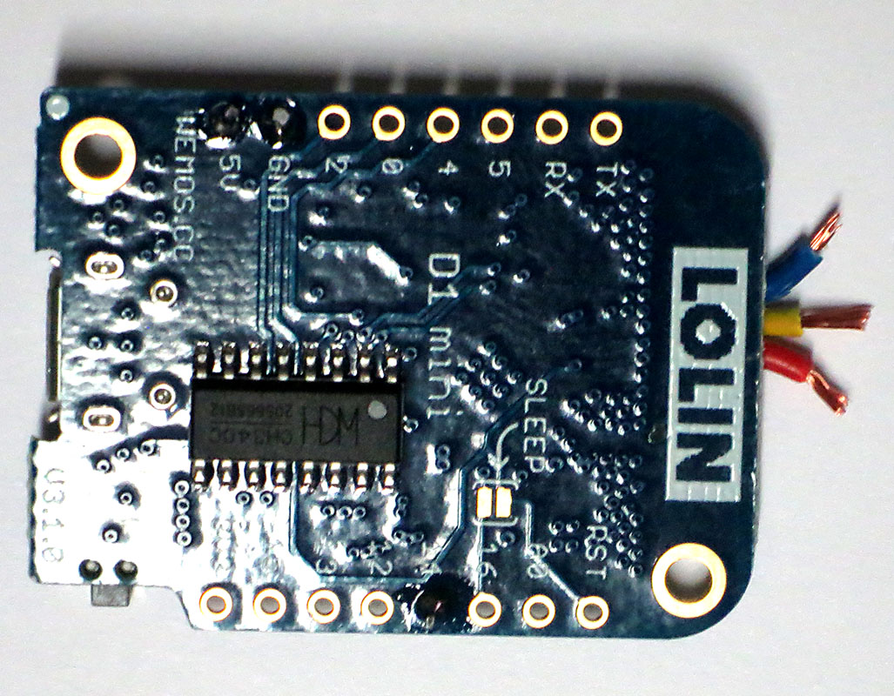
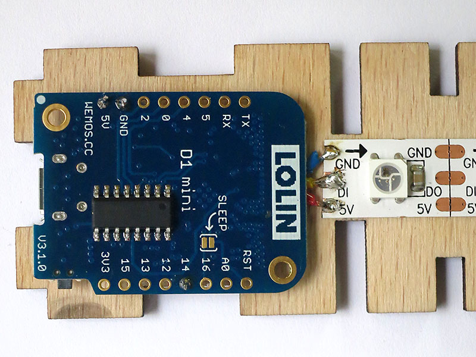
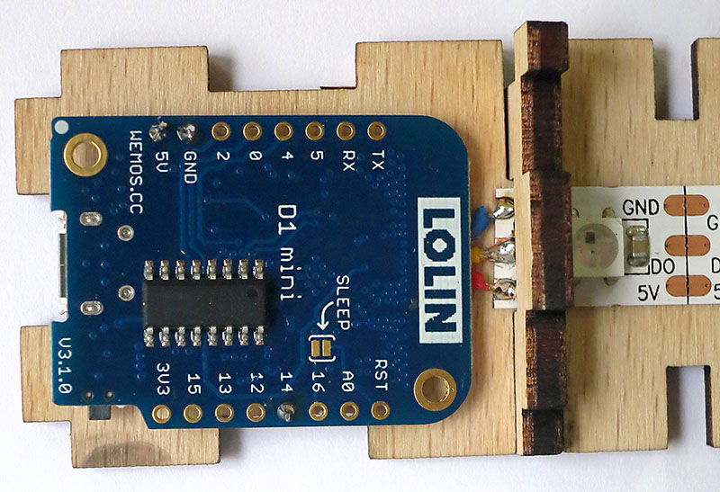
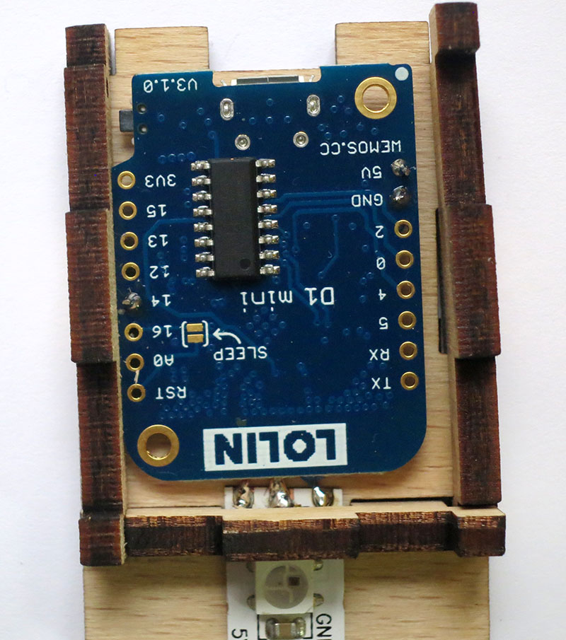
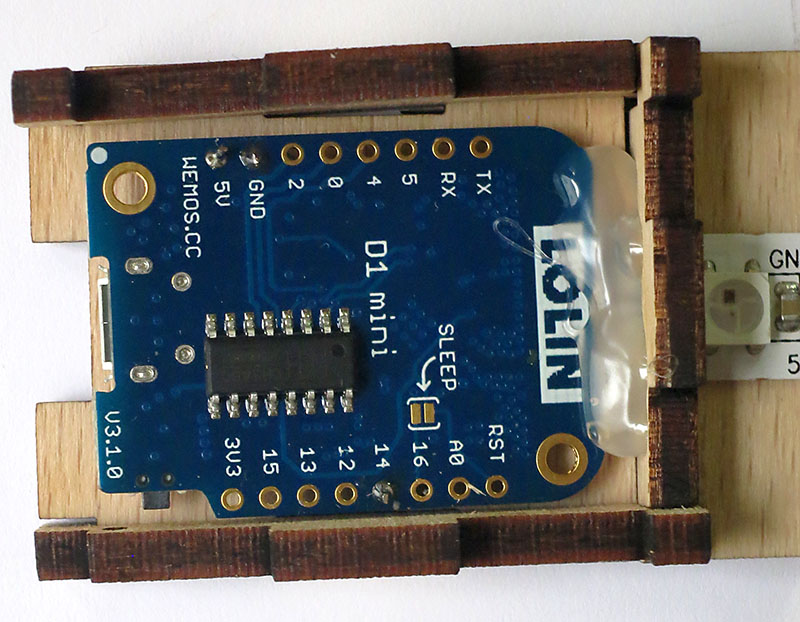

FLKA-LIGHTBOARD
===
___
Das hier ist die Software für unsere Version des [LIGHTBOARD-Workshops aus dem Projekt PHABLABS 4.0](http://phablabs.eu/workshop/light-board). Wir steuern die WS2812-LEDs über eine Weboberfläche, die einerseits RGB-Regler bietet, andererseits die Farbauswahl über einen Farbkreis im HSL-System bietet.

Die Regler sind synchronisiert, so dass der Zusammenhang zwischen den RGB-Farbwerten und dem HSL-Modell verständlich erklärt werden kann.

Folgende Schritte sind sinnvoll, um die additive Farbmischung zu erläutern:
### Den Farbwert (Hue) erforschen ###
Bei voller Sättigung (100%) und halber Helligkeit (50%) wird der H-Regler über den gesamten Wertebereich verstellt.
Es fällt auf, dass jeder Farbwert nur aus zwei der drei Grundfarben gemischt wird. Beginnend bei Rot wird der Regler nach rechts gezogen und damit immer mehr Grünanteil hinzugemischt, bis bei 100% Rot und Grün Gelb ensteht.
Beim Weiterziehen wird nun Rot reduziert, bis nur noch reines Grün leuchtet. Wieder weiter wird Blau zum Grün hinzugefügt, bis Cyan angezeigt wird.  Beim Weiterdrehen wird Grün reduziert, bis nur noch Balu leuchtet. Nun wird wieder Rot hinzugefügt, bis bei 100% Rot und 100% Blau Magenta entsteht. Beim Weiterziehen wird nun wieder Blau redzuziert, bis Rot übrigbleibt.
###Helligkeit (Lightness) erforschen###
Im Anschluss wird der Helligkeitsregler erkundet:
Wird dieser nach rechts (Richtung 100%) verschoben, so erkennt man bei den RGB-Reglern, dass nun die dunkleren Regler alle ebenfalls nach rechts gezogen werden.  In der Endstellung bei 100% leuchten alle drei Farben und das entstehende Licht ist Weiß. 
Wird der Regler nach links gezogen, wandern alle drei RGB-Farben proportial ebenfalls nach links, bis bei 0% die LEDs erloschen sind, bzw. Schwarz entstanden ist.
###Sättigung (Saturation) erforschen###
Zuletzt wird der Sättigungsregler erkundet: Bei einem Helligkeitswert von 50% steht dieser zunächst bei 100%, so dass eine reine Farbe angezeigt wird.
Beim nach Links ziehen (Sättigung wegnehmen), laufen die RGB-Regler aufeinander zu: Die helleren Werte werden dunkler, während die dunkleren Werte heller werden.  Bei einer Sättigung von 0% treffen sich die RGB-Werte genau beim Wert der Helligkeit, es entsteht Grau.

Komponenten
-----------
Als Controller wird ein ESP8266 in Form eines WeMos D1 mini (LOLIN) verwendet. Das Gehäuse ist für die Variante mit direkt aufgelötetem ESP-Chip entworfen. 

Zusammenbau
-----------
- Wemos-Platinen programmieren und die Erreichbarkeit über WLAN sicherstellen. (ggf. VOR dem Workshop)
- Dabei dann die Boards ggf. auf teilnehmerspezifische SSID und PWD konfigurieren! (ggf. VOR dem Workshop)
- Teile für [Plattenhalter lasern (entworfen für 3,7mm Buche)](./SVG-Laserparts/FLKA-Lightboard.svg)
- WS2812 RGB-Streifen mit 9LED **mittig** wie abgebildet auf die Grundplatte kleben. Data In (DI) muss auf die Controllerseite zeigen, die erste LED muss dabei ausserhalb des späteren Controllergehäuses liegen.

- An den Wemos drei kürzere Kabel anlöten: ***5V***, ***GND*** und ***D5*** *(Arduino 14*)
- Die Kabel auf der Stirnseite der Wemos-Platine nach aussen führen, so dass in Schreibrichtung
  - die **+5V-Leitung** unten liegt
  - die **GND-Leitung** oben liegt
  - die Leitung von **D5 (Data In)** in der Mitte
  
- Alle drei Kabel ca 5mm überstehen lassen und auf etwa 3mm abisolieren.
- Die drei Kabel an die entsprechend benannten Pins des LED-Streifen anlöten.
    
- Das erste Gehäuseteil über die Lötpunkte aufstecken
  
- Die seitlichen Gehäuseteile von aussen aufstecken, dabei die Seite mit Loch zum Reset-Taster orientieren
  
- Die Wemos-Platine mit etwas Heisskleber an der Stirnseite befestigen (nur so hoch, dass auch der Gehäusedeckel später noch passt!
Die Wemos-Platine soweit in den noch heissen Kleber schieben, dass der USB-Anschluss nicht über die Gehäuseinnenkante ragt.
Die Platine darf dabei auf der Stirnseite etwas nach unten gedrückt werden.
  
- Nun die Teilnehmer ihre Platine testen lassen. Noch ist das Gehäuse nicht verschlossen und Reparaturen möglich.
- Wenn alles funktioniert, Gehäuse schliessen.
  
- Füße von beiden Seiten auf die Grundplatte schieben, so dass die Acrylglasplatte mittig über den LED gehalten wird. Die Füße ggf. verleimen.
- Platte bemalen, beste Erfahrungen haben wir mit Molotow-Markern gemacht!

Software
--------
Es wird empfohlen eine möglichst aktuelle Arduino-IDE (mindestens 1.8.7) zu verwenden. Bei älteren IDEs kommt es mit den aktuellen ESP-Toolchains zu Problemen.  Die verwendeten asynchronen Bibliotheken benötigen mindestens die Version 2.3 des ESP-Tools, die entweder über den [Boardmanager](https://github.com/esp8266/Arduino#installing-with-boards-manager) oder aber direkt als [GIT-Version](https://arduino-esp8266.readthedocs.io/en/latest/installing.html#using-git-version)installiert werden kann.

Zusätzlich muss der Arduino-IDE noch der [ESP-Uploadmanager hinzugefügt werden](http://esp8266.github.io/Arduino/versions/2.3.0/doc/filesystem.html#uploading-files-to-file-system "Uploading files to SPIFFS"). Damit bekommt die IDE unter dem Werkzeuge Menupunkt eine weitere Option: **"ESP8266 Sketch Data Upload"**. 
Mit dem Uploadmanager werden alle Dateien aus einem Unterverzeichnis namens "data" in ein SPIFFS-Dateisystem konvertiert und in den zweiten, 3MB großen, FLASH-Bereich des WeMos D1 mini geladen.

Zum Fehlersuchen ist die Erweiterung [ESP Exception Stack Decoder](https://github.com/me-no-dev/EspExceptionDecoder) hilfreich, mit deren Hilfe festgestellt werden kann, wo etwas schief läuft, wenn beim Debuggen im Terminalfenster ein hexadezimaler Stackdump angezeigt wird.

Bibliotheken
------------
Neben den vorhandenen Arduino bzw. ESP-Standardbibliotheken werden folgende Bibliotheken aus Github-Repositories ohne Veränderung verwendet:

- [**ESPAsyncUDP.h**]( http://github.com/me-no-dev/ESPAsyncUDP "Asynchrones UDP")
- [**ESPAsyncTCP.h**]( http://github.com/me-no-dev/ESPAsyncTCP "Asynchrones TCP")

Compilieren und Laden des Programmes
------------------------------------
- Herunterladen des Programmcodes oder Clonen des Github-Repositories
- Installieren der zusätzlichen Komponenten in der Arduino IDE
  - ESP8266 Toolchain (entweder über Bibliotheksmanager oder aus [Github]([GIT-Version](https://arduino-esp8266.readthedocs.io/en/latest/installing.html#using-git-version)
  - Installation des [ESP Sketch Data Upload-Tools](http://esp8266.github.io/Arduino/versions/2.3.0/doc/filesystem.html#uploading-files-to-file-system)
  - Optional: [ESP Exception Stack Decoder](https://github.com/me-no-dev/EspExceptionDecoder) 
  - [**ESPAsyncUDP.h**]( http://github.com/me-no-dev/ESPAsyncUDP "Asynchrones UDP")
  - [**ESPAsyncTCP.h**]( http://github.com/me-no-dev/ESPAsyncTCP "Asynchrones TCP")
  - Adafruit Neopixel (Über den Bibliotheksmanager der Arduino IDE)
- Öffnen der Datei FLKA-Lightboard.ino in der Arduino IDE
- Folgende Einstellungen für das Board vornehmen:
  - ***Lolin (Wemos) D1 R2 & mini***
  - Flash Size: ***4M (3M SPIFFS)***
  - Erase Flash: ***All Flash Contents*** 
- Programm Compilieren und auf den Controller laden
- Inhalt des SPIFFS-Dateisystem mit dem Menüpunkt: ***Werkzeuge=> ESP8266 Sketch Data Upload*** auf den Controller laden.
- Für ein erneutes Hochladen des Programmcodes ***Erase Flash*** wieder auf ***Only Sketch*** stellen. Somit bleiben das SPIFFS-Dateisystem und eventuell gespeicherte Konfigurationsdaten erhalten.

Aktuell implementierte Funktionen
---------------------------------
Derzeit startet der ESP in den AP-Mode und ist über den im Sourcecode hinterlegten SSID-Namen **FLKA-LIGHTBOARD** und das Passwort **ABCdef123456** erreichbar.
Die vorkonfigurierten Werte für SSID, WLAN-Passwort, Admin-Account und Passwort lassen sich in der Datei ***AllIncludes.h*** ändern. Die Werte können jedoch später zur Laufzeit jederzeit in der Weboberfläche geändert werden.
Sollte der ESP bereits die Zugangsinformationen zu einem aktuell erreichbaren WLAN gespeichert haben (z.B. weil vorher ein anderer Sketch geladen war), so verbindet er sich dorthin! Um das zu verhindern, sollte der ESP beim ersten Programmieren mit der Option ***"Erase Flash: All Flash contents"*** programmiert werden.
Wird der ESP später als Client in ein anderes WLAN gehangen, so ist es einerseits über mDNS erreichbar (aka Bonjour) oder es muss am jeweiligen Router nachgesehen werden, welche IP das Gerät bekommen hat.

